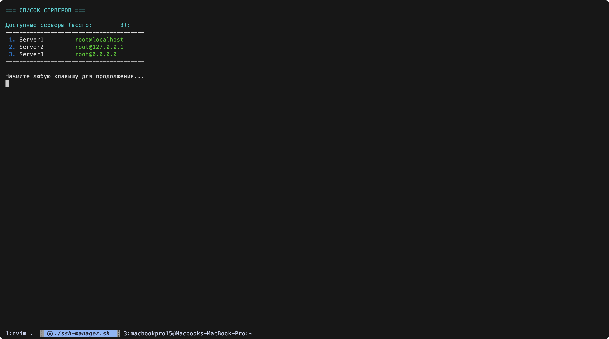
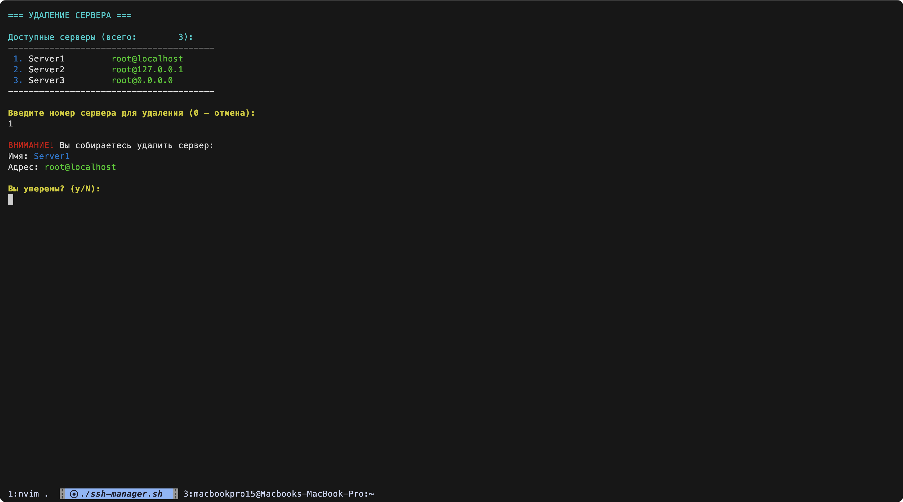

# SSH Manager

SSH Manager — это интерактивный скрипт на Bash с красивым интерфейсом, который позволяет управлять списком SSH-серверов и легко подключаться к ним. Скрипт поддерживает добавление, удаление и подключение к серверам, а также автоматическую генерацию SSH-ключей.

## 🎯 Особенности

- **🖥️ Интерактивное управление**: Управление одним нажатием клавиши без необходимости нажимать Enter
- **🎨 Красивый интерфейс**: Цветное оформление и структурированное меню
- **➕ Добавление серверов**: Легко добавляйте новые SSH-серверы в список с валидацией ввода
- **🗑️ Удаление серверов**: Удаляйте ненужные серверы из списка с подтверждением
- **🔗 Подключение к серверам**: Быстро подключайтесь к любому серверу из списка
- **📊 Отображение статистики**: Показ количества серверов и подробной информации
- **🔑 Генерация SSH-ключей**: Автоматическая генерация SSH-ключей, если они отсутствуют
- **🛡️ Безопасность**: Проверка дублирования серверов и валидация ввода
- **🌐 Поддержка языков**: Работа с русской и английской раскладкой клавиатуры

## 📸 Скриншоты

### Главное меню
<!-- Добавьте скриншот главного меню здесь -->


### Список серверов
<!-- Добавьте скриншот списка серверов здесь -->


### Добавление сервера
<!-- Добавьте скриншот процесса добавления сервера здесь -->


### Подтверждение удаления
<!-- Добавьте скриншот подтверждения удаления здесь -->


## 📋 Требования

- **Bash**: Скрипт написан на Bash и требует наличия Bash в системе
- **ssh-keygen**: Необходим для генерации SSH-ключей
- **ssh-copy-id**: Необходим для отправки публичного ключа на сервер
- **stty**: Для управления терминалом (обычно предустановлен)

## 🚀 Установка

1. **Склонируйте репозиторий**:

   ```bash
   git clone https://github.com/ProFastCode/ssh-manager.git
   cd ssh-manager
   ```

2. **Сделайте скрипт исполняемым**:

   ```bash
   chmod +x ssh-manager.sh
   ```

3. **Добавьте скрипт в переменную окружения PATH**:

   **Для Bash:**

   ```bash
   echo 'export PATH=$PATH:'$(pwd) >> ~/.bashrc
   source ~/.bashrc
   ```

   **Для Zsh:**

   ```bash
   echo 'export PATH=$PATH:'$(pwd) >> ~/.zshrc
   source ~/.zshrc
   ```

   **Альтернативный способ (создание символической ссылки):**

   ```bash
   sudo ln -s $(pwd)/ssh-manager.sh /usr/local/bin/ssh-manager
   ```

## 🎮 Использование

Запустите скрипт из любой директории:

```bash
ssh-manager
```

### Управление клавишами

После запуска вы увидите красивое интерактивное меню. Управление осуществляется одним нажатием клавиши:

- **`[a]`** - Добавить сервер
- **`[d]`** - Удалить сервер  
- **`[c]`** - Подключиться к серверу
- **`[l]`** - Показать список серверов
- **`[q]`** - Выйти

### Подробное описание функций

#### 1. Добавление сервера (`[a]`)

При добавлении сервера вам будет предложено ввести:

- **Имя сервера**: Уникальное имя для идентификации
- **IP-адрес или доменное имя**: Адрес сервера для подключения
- **Имя пользователя**: Пользователь для SSH-подключения

Скрипт автоматически:

- Проверит уникальность имени сервера
- Сгенерирует SSH-ключи при необходимости
- Отправит публичный ключ на сервер

#### 2. Удаление сервера (`[d]`)

При удалении:

- Отображается список всех серверов с номерами
- Показывается подробная информация о выбранном сервере
- Требуется подтверждение удаления
- Возможность отменить операцию

#### 3. Подключение к серверу (`[c]`)

При подключении:

- Отображается список доступных серверов
- Показывается информация о подключении
- Автоматическое использование SSH-ключей

#### 4. Просмотр списка (`[l]`)

Отображает все серверы в удобном формате с информацией:

- Номер сервера
- Имя сервера
- Пользователь и IP-адрес
- Общее количество серверов

## 📝 Примеры использования

### Добавление сервера

```
=== ДОБАВЛЕНИЕ НОВОГО СЕРВЕРА ===

Введите имя сервера: production-server
Введите IP-адрес или доменное имя сервера: 192.168.1.100
Введите имя пользователя для подключения: admin
Отправка публичного ключа на сервер...
Сервер 'production-server' успешно добавлен!
```

### Просмотр серверов

```
Доступные серверы (всего: 3):
----------------------------------------
 1. production-server  admin@192.168.1.100
 2. dev-server         user@dev.example.com
 3. backup-server      root@backup.local
----------------------------------------
```

### Удаление сервера

```
ВНИМАНИЕ! Вы собираетесь удалить сервер:
Имя: production-server
Адрес: admin@192.168.1.100

Вы уверены? (y/N): y
Сервер 'production-server' успешно удален.
```

## 📁 Структура файлов

```
ssh-manager/
├── ssh-manager.sh          # Основной скрипт
├── README.md              # Документация
├── LICENSE               # Лицензия
└── screenshots/          # Папка для скриншотов
    ├── main-menu.png
    ├── server-list.png
    ├── add-server.png
    └── delete-confirmation.png
```

## ⚙️ Конфигурация

Скрипт использует следующие файлы и директории:

- **`~/.ssh_servers`** - файл конфигурации со списком серверов
- **`~/.ssh/`** - директория для SSH-ключей
- **`~/.ssh/id_rsa`** - приватный SSH-ключ
- **`~/.ssh/id_rsa.pub`** - публичный SSH-ключ

## 🐛 Устранение неполадок

### Проблема: Не работает управление клавишами

**Решение**: Убедитесь, что ваш терминал поддерживает команду `stty`. Попробуйте запустить в другом терминале.

### Проблема: Ошибка при отправке SSH-ключа

**Решение**:

- Проверьте доступность сервера
- Убедитесь в правильности учетных данных
- Проверьте настройки SSH на целевом сервере

### Проблема: Не отображаются цвета

**Решение**: Ваш терминал может не поддерживать ANSI-коды. Попробуйте использовать современный терминал.

## 🔒 Безопасность

- Скрипт использует RSA-ключи длиной 4096 бит
- Приватные ключи хранятся только локально
- Поддержка аутентификации по ключам без паролей
- Проверка валидности вводимых данных

## 🤝 Вклад в проект

Вклады приветствуются! Для внесения изменений:

1. Создайте форк репозитория
2. Создайте ветку для новой функции (`git checkout -b feature/AmazingFeature`)
3. Зафиксируйте изменения (`git commit -m 'Add some AmazingFeature'`)
4. Отправьте в ветку (`git push origin feature/AmazingFeature`)
5. Создайте Pull Request

### Идеи для улучшений

- [ ] Поддержка различных типов SSH-ключей (Ed25519, ECDSA)
- [ ] Экспорт/импорт конфигурации серверов
- [ ] Группировка серверов по категориям
- [ ] Интеграция с популярными облачными провайдерами
- [ ] Поддержка SSH-туннелей и проброса портов

## 📄 Лицензия

Этот проект лицензирован под MIT License - см. файл [LICENSE](LICENSE) для подробностей.

## 👤 Автор

**ProFastCode**

- Email: <fast.code.auth@gmail.com>
- GitHub: [@ProFastCode](https://github.com/ProFastCode)

## 📝 Changelog

### v2.0.0 (Текущая версия)

- ✨ Добавлено управление одним нажатием клавиши
- 🎨 Красивый цветной интерфейс
- ✅ Подтверждение при удалении серверов
- 📊 Отображение количества серверов и подробной информации
- 🛡️ Улучшенная валидация ввода
- 🌐 Поддержка русской и английской раскладки
- 🔍 Отдельная опция просмотра списка серверов

### v1.0.0

- 🚀 Базовый функционал добавления, удаления и подключения к серверам
- 🔑 Автоматическая генерация SSH-ключей

---

⭐ Если проект оказался полезным, поставьте звездочку на GitHub!
